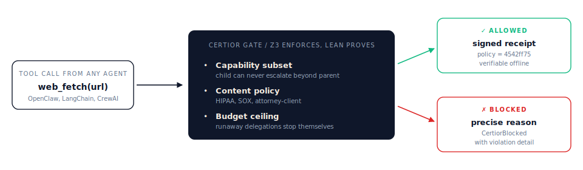

# Certior

> **Provable boundaries for multi-agent AI.** A capability boundary for OpenClaw, LangChain, CrewAI, and your own delegation chains - every agent-to-agent call is checked by Z3 against a Lean-audited policy before it runs. Allowed calls return a signed receipt. Blocked calls raise `CertiorBlocked` with a precise reason.

[](https://github.com/paulinebourigault/certior/actions/workflows/python-ci.yml)
[](https://pypi.org/project/certior/)
[](https://docs.certior.io)
[](https://certior.io)
[](LICENSE)
[](pyproject.toml)

<p align="center">
  
</p>

> A capability boundary for multi-agent AI - with a policy model proven sound in Lean 4 and enforced by Z3 on every tool call.

## Install

```bash
pip install certior
```

## Quickstart

```python
from certior import Guard, CertiorBlocked

guard = Guard(permissions=["network:http:read"])           # an agent's capability boundary

@guard.wrap(required_capabilities=["network:http:read"])   # tool calls + child agents must fit inside
def web_fetch(url): ...

web_fetch("https://example.com")  # allowed → call runs, recorded in guard.audit_log
                                   # capability escalation → raises CertiorBlocked
                                   # signed certificate of the decision: guard.verify(...).certificate
```

One decorator. Wraps any function. The rest of your code is unchanged.

## What it does

Most AI safety work makes agents more *capable* or more *correct*. Certior solves the orthogonal problem: bounding what an agent is *allowed* to do - because a prompt that says "don't" is not a security boundary. Three gates run before every tool call:

| Gate | Checks | How |
|---|---|---|
| **Capability** | child agent's capabilities ⊆ parent's; tool requires only what's granted | Lean 4 (offline proof of the rule) + Z3 (per-call enforcement) |
| **Content** | HIPAA / SOX / attorney-client / custom detectors on prompts and outputs | content policy presets, per-policy detectors |
| **Budget** | per-agent hard ceiling; every step debits the parent | running ledger |

Allowed calls return a signed certificate bound to a Lean-checked policy fingerprint. Blocked calls raise `CertiorBlocked` with a precise reason. An auditor reproduces the audit with a single `lake build`.

## Adapters

| Framework | Module | Status |
|---|---|---|
| OpenClaw | `certior.adapters.openclaw` | ✅ shipped |
| OpenAI tool use | `certior.adapters.tool_use` | ✅ shipped |
| LangChain | `certior.adapters.langchain` | ✅ shipped |
| CrewAI | `certior.adapters.crewai` | ✅ shipped |
| MCP / custom | wrap any callable with `@guard.wrap` | ✅ always |

See [docs/bring-your-own-framework.md](docs/bring-your-own-framework.md) for per-framework recipes.

## Examples

Runnable demos in [`examples/`](examples/):

- [`wrapper_quickstart.py`](examples/wrapper_quickstart.py) - the 5-line recipe + all proof obligations
- [`openai_agent_demo.py`](examples/openai_agent_demo.py) - OpenAI tool calling with jailbreak / PII / budget block paths
- [`07_multi_agent_reviewed_release.py`](examples/07_multi_agent_reviewed_release.py) - workflow-stage approval + release gate
- [`08_all_provers_showcase.py`](examples/08_all_provers_showcase.py) - Z3 gate + Dafny seccomp/path-safety evidence in one run

See [examples/README.md](examples/README.md) for the full list and which demo answers which question.

## What is proven

| Layer | Tool | Runs | Guarantees |
|---|---|---|---|
| **Runtime gate** | Z3 (SMT) | every tool call (~tens of ms) | the action is admitted only if it provably satisfies the capability, budget, and information-flow constraints |
| **Policy model** | Lean 4 | offline / CI | the lattice, delegation, IFC and composition rules the gate relies on are sound |
| **Kernel properties** | Dafny | offline / CI | specific properties (path-safety, seccomp policy) are statically verified |

What's proven today: **155 theorems, 0 `sorry`, 0 axioms beyond Lean's standard three** (`propext`, `Classical.choice`, `Quot.sound`). The model covers the shipped capability surface and is extended as new capabilities and policy classes land. CI (`.github/workflows/lean4-ci.yml`) fails the build if any guarantee stops depending only on Lean's standard axioms - any regression in the proof is caught at commit time.

What Certior does *not* claim: it does not verify the LLM's behaviour. It verifies the **boundary** the LLM operates inside. If an action violates the policy, it is provably blocked - and the policy itself is proven sound.

## Server and Studio (optional, self-host)

The repository also ships a FastAPI server and a Next.js dashboard for teams that want to self-host a control plane on top of the SDK:

```bash
pip install "certior[api]"        # FastAPI server + WebSocket streaming
./run.sh                          # start uvicorn locally (dev)
```

Production deployments require `CERTIOR_KMS_ROOT_SECRET` and `CERTIOR_API_KEYS_JSON` to be set; see [CONFIGURATION.md](CONFIGURATION.md#security) for the full checklist and the secret-generation one-liners.

Operator setup, runtime modes, and environment variables live in [OPERATIONS.md](OPERATIONS.md) and [CONFIGURATION.md](CONFIGURATION.md).

## Documentation

| For | Read |
|---|---|
| Devs integrating Certior | [docs/guides/openai.md](docs/guides/openai.md), [docs/bring-your-own-framework.md](docs/bring-your-own-framework.md) |
| Architecture / how it works | [docs/concepts/how-it-works.md](docs/concepts/how-it-works.md), [docs/openclaw-defenses.md](docs/openclaw-defenses.md) |
| Auditors / customers | [docs/certior-trust-package.md](docs/certior-trust-package.md) |
| API reference | [docs/api-contract.md](docs/api-contract.md) |
| Lean policy kernel | [docs/lean-binary.md](docs/lean-binary.md), [lean4/README.md](lean4/README.md) |
| Skill auditing CLI | [docs/openclaw-skill-audit.md](docs/openclaw-skill-audit.md) |
| Operators / deployment | [OPERATIONS.md](OPERATIONS.md), [CONFIGURATION.md](CONFIGURATION.md) |
| Contributors / local dev | [DEVELOPER.md](DEVELOPER.md), [CONTRIBUTING.md](CONTRIBUTING.md) |
| Security disclosure | [SECURITY.md](SECURITY.md) |
| Release notes | [CHANGELOG.md](CHANGELOG.md) |

## License

[Apache-2.0](LICENSE).
